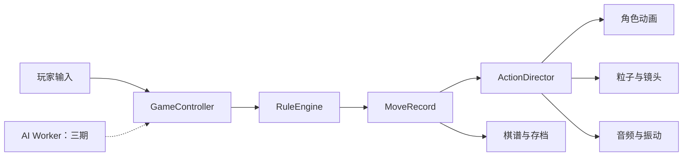

# 玄甲棋局二期开发方案

> 2026-09-06 追加任务已实施：C1 连续泥土战场替换木质棋盘；14 类棋子各有 6 段动作与三档运行包。动画新增 105 积分、土壤材质 10，累计 1197，核实余额 1868。当前验收和限制见 [交付报告](docs/asset-reports/PRODUCTION_DELIVERY.md)。下方早期阶段的静态范围与预算保留作历史计划。

## 1. 文档信息

- 项目：玄甲棋局 3D 中国象棋
- 修订日期：2026-09-05；核对代码基线：`991384f`
- 阶段：二期，本地双人公开试玩版
- 当前状态（2026-09-06 更新）：高模/PBR 棋子、三档运行版、棋盘和环境已接入，加载容错检查通过；骨骼动画和手机真机/发布级性能仍待验收，见[静态美术交付报告](docs/asset-reports/PRODUCTION_DELIVERY.md)
- 排期方式：按工作量、人力和依赖估算；完整样板通过后再冻结批量工期，见第 10 节
- 二期出口：具备正式美术、可取消战斗演出、棋谱存档和发布级性能的本地双人版本
- 三期范围：单机 AI 产品化；既有 AI 实现作为待评估工程储备，保留接口和测试，不计入二期发布门槛

本文负责产品范围、里程碑与发布验收；[美术资产精修流水线](docs/PHASE_2_ART_PIPELINE.md)负责资产任务、样板检查和逐枚验收。两份文档使用相同的阶段边界。

## 2. 二期定位

### 2.1 核心目标

二期将当前原型升级为可以公开展示和持续迭代的本地双人产品：

1. 用正式 GLB 角色替换程序化一期棋子，同时保持棋局辨识度。
2. 建立可复用的动作、击杀、音频和镜头时间线。
3. 先通过完整样板、模型加载降级和 32 枚棋子的性能检查，再批量制作资产。
4. 加入棋谱、回放、保存、恢复和 FEN 导入导出。
5. 完成桌面与移动端性能优化、兼容测试和发布流程。

### 2.2 非目标

- 单机 AI 的产品化、棋力校准和真实 Worker 长时间验收，移交三期。
- 联网匹配、好友房、观战和断线重连。
- 账号、排行榜、商城、赛季和付费系统。
- 服务端权威裁决和反作弊。
- 长将、长捉等竞赛争议裁决，除非二期另行立项。
- 本地训练大型神经网络象棋模型。

AI 产品化移交三期，其余能力在后续独立专项中另排。

### 2.3 成功指标

- 玩家能够完成“开始本地双人对局、走子、吃子、悔棋、保存、恢复、回放、结束”的完整流程。
- 32 枚正式棋子同屏时，桌面目标 50 至 60 FPS，主流手机不低于 30 FPS。
- 任一正式模型返回 404、超时或损坏时，该棋子仍可用回退造型操作，其他棋子和棋盘保持可用。
- 所有移动、攻击、受击和移除严格按照表现事件点执行。
- 存档恢复后的局面、回合、棋谱、设置和棋子数量完全一致。

## 3. 开发前置门槛

### 3.1 许可证决策

当前规则依赖 `elephantops@0.1.1`，许可证为 GPL-3.0-or-later。二期先确定规则库和资产的发布路线；AI 引擎相关评估在三期启用前单独完成。

M0 阶段必须确定发布方式：

- 路线 A：接受 GPL 要求，按照相应许可证发布。
- 路线 B：取得规则库的其他授权。
- 路线 C：替换为许可证兼容的规则实现。
- 路线 D：自研或委托开发规则核心。

在许可证路线冻结前，不应将当前依赖直接用于闭源商业发布。该事项需要专业法律意见时，应交由法务或许可证顾问确认。

### 3.2 一期技术基线

二期继续复用以下稳定边界：

- `src/game/rules`：规则适配层，负责合法着法、将军和胜负。
- `src/game/useGameController.ts`：棋局、选择、动画锁、历史和设置。
- `src/scene`：棋盘、棋子、特效、灯光和镜头。
- `src/ui`：回合状态、棋谱和工具栏。
- `MoveRecord`：规则层与表现层之间的唯一走子事件。

规则状态仍然是唯一事实来源。模型动画、特效、音频和 AI 都不能直接修改棋局状态。

### 3.3 当前能力与待复用内容

以下为 2026-09-05 对 `991384f` 的检查结果，不代表未来实现已完成：

| 项目 | 当前主分支 | 下一步 |
| --- | --- | --- |
| 本地双人、规则、悔棋和重开 | 已实现 | 保留并执行回归检查 |
| 14 枚 GLB 与 URL 清单 | 已接入；共 4,994,236 字节 | 作为静态素模基线，继续精修 |
| 模型加载失败回退 | 未实现；单个 GLB 404 会令整个棋盘进入错误页 | 首先补齐逐棋子降级、重试和测试 |
| PBR 贴图、骨骼、动画、三档 LOD | 14 枚现有 GLB 均无纹理、skin 和动画；只有单档模型 | 样板先验证完整导出及运行流程 |
| ActionDirector、存档、回放、AI | 当前主分支未接入；本地备份包含候选实现和测试 | 按模块比较、迁移、重新验收 |
| 性能 | 静态统计每枚 23–117 个绘制单元、10–13 个材质；开局约 1,447 个模型绘制单元 | 先减少绘制单元，再做整帧实测；该统计不等于实测 Draw Call |

本地候选来源为备份 `b069c5239506b9bc519e6c4a6631baceef9f3dc6`（说明：`codex-before-pull-20260905-local-work`）。它不是远程主分支的一部分，`stash` 序号也可能变化。M0 应先保留可复核的备份引用，再按时间线、加载器、存档、回放、AI 分别记录“复用 / 适配 / 暂缓”及差异；选用模块以独立提交迁入当前管线。备份中的模型命名、manifest 和控制器不能视为与当前版本直接兼容。

本次检查证据：15 项单元测试、lint、生产构建通过；Chrome 正常加载 14 枚模型，注入单模型 404 时复现棋盘错误页。尚无当前版本的真机性能报告，也未将备份中的测试数量计入本分支验收。

## 4. 功能范围

### 4.1 正式 3D 棋子

- 红方采用朱红漆甲、铜金护片和轻捷轮廓。
- 黑方采用玄铁重甲、银灰护片和厚重轮廓。
- 按人形、四足、机械划分基础结构，复用兼容的骨架、材质和类型组件；红黑阵营共交付 14 个成品组合，车兵、骑手等作为所属棋子的部件管理。
- 七类棋子通过体型、头冠、武器、肩甲和动作区分。
- 棋子底座继续保留传统汉字，保证中远距离识别。
- 支持 LOD、压缩纹理、模型预加载和加载失败回退。

### 4.2 动作与击杀演出

每类棋子至少支持：

- `idle`：待机呼吸或轻微甲片运动。
- `selected`：选中姿态。
- `move`：普通移动。
- `attack`：吃子攻击。
- `hit`：受击。
- `death`：碎甲、倒地或消散。
- `victory`：胜利姿态。

特殊表现建议：

| 棋子 | 移动表现 | 吃子表现 |
| --- | --- | --- |
| 车 | 重甲冲锋、地面尘轨 | 强力撞击、金属碎片 |
| 马 | 跃动弧线、马蹄残影 | 跃击、落地震环 |
| 炮 | 炮身蓄力、火星 | 爆燃、后坐力、烟尘 |
| 兵/卒 | 短促突进 | 近身劈砍 |
| 相/象 | 厚重踏步、阵纹 | 护阵冲击 |
| 仕/士 | 轻步、符纹 | 交叉武器斩击 |
| 帅/将 | 稳重移动、旗帜响应 | 统帅攻击和胜负演出 |

### 4.3 单机 AI（三期工程储备）

以下保留为三期目标。二期不新增 AI 产品入口，不将 AI 功能、棋力或 100 局测试纳入发布门槛；备份中的实现和测试保留待评估。

- 玩家可选择执红、执黑或随机阵营。
- 提供简单、普通、困难三档难度。
- AI 在 Web Worker 中执行，不占用 Three.js 主渲染线程。
- 支持取消思考、重开、悔棋和切换局面后的任务失效。
- AI 输出的走法必须再次通过项目规则层验证。
- AI 异常或超时不能破坏当前棋局，应显示可恢复状态。

推荐思考预算：

| 难度 | 单步时间 | 策略 |
| --- | ---: | --- |
| 简单 | 100 至 300 ms | 从候选着法中加入受控随机性 |
| 普通 | 500 至 1200 ms | 平衡搜索深度和响应速度 |
| 困难 | 2 至 4 s | 更深搜索，可提供取消按钮 |

### 4.4 棋谱、回放和存档

- 保存完整结构化着法，不只保存界面文本。
- 支持逐步前进、后退、跳转到首步和末步。
- 支持保存当前对局和恢复最近对局。
- 支持 FEN 导入导出，方便残局和测试局面分享。
- 存档必须包含 `schemaVersion`，为后续数据迁移保留能力。
- 棋谱回放期间不能修改正式对局状态。

### 4.5 音频和体验

- 增加移动、落地、甲片、武器、炮击、受击、将军和胜负音效。
- 背景音乐、环境音和战斗音效分别控制音量。
- 设置保存在浏览器本地。
- 增加棋盘翻转、先后手选择和减少动态效果模式。
- 手机端支持可关闭的振动反馈。

## 5. 技术架构



### 5.1 新增模块建议

先核对备份中的同名模块再决定迁移或新建。下列 `ai/` 属于三期，其余模块按 M0–M5 逐步接入。

```text
src/
├─ ai/
│  ├─ AiEngine.ts
│  ├─ ai.worker.ts
│  ├─ difficulty.ts
│  └─ protocol.ts
├─ assets/
│  ├─ manifest.ts
│  ├─ preload.ts
│  └─ fallbacks.ts
├─ game/
│  ├─ replay/
│  └─ persistence/
├─ scene/
│  ├─ animation/
│  │  ├─ ActionDirector.ts
│  │  └─ actionTimeline.ts
│  ├─ models/
│  └─ effects/
└─ audio/
   ├─ AudioDirector.ts
   └─ soundManifest.ts
```

### 5.2 `ActionDirector` 时间线

推荐事件顺序：

```text
MOVE_ACCEPTED
  -> ATTACKER_START
  -> CONTACT
  -> TARGET_HIT
  -> TARGET_REMOVE
  -> SETTLE
  -> TURN_READY
```

要求：

- `CONTACT` 前被吃棋子必须仍然存在。
- 目标保留至 `TARGET_REMOVE`；音效在 `CONTACT`、受击和镜头反馈在对应事件点触发。
- 粒子、音频和镜头震动从事件点触发，禁止分别使用无关联的延时器。
- 悔棋、重开或组件卸载时，时间线必须可以整体取消。
- 恢复存档、导入 FEN 和进入回放也必须先取消时间线；旧回调不得移除新局面棋子或再次提交完成事件。
- 低特效模式可以缩短表现，但不能改变规则结果。
- 格点移动由控制器和表现时间线统一驱动；骨骼动作叠加在棋子内部，避免根运动与格点插值重复位移，结束位置必须精确对格。
- 相同 GLB 的不同棋子拥有独立骨架和播放状态；LOD 切换保持当前动作进度，悔棋、重开和卸载释放实例播放资源。

### 5.3 AI Worker 协议（三期预留）

```ts
type AiRequest = {
  requestId: number;
  fen: string;
  difficulty: "easy" | "normal" | "hard";
  timeLimitMs: number;
};

type AiResponse = {
  requestId: number;
  move: string | null;
  depth?: number;
  score?: number;
  error?: string;
};
```

`requestId` 用于废弃悔棋、重开或局面变化前发起的旧任务。

## 6. 美术资产规范

### 6.1 模型预算

| 项目 | 建议预算 |
| --- | --- |
| 单棋子 LOD0 | 不超过 20k 三角面 |
| 单棋子 LOD1 | 不超过 8k 三角面 |
| 单棋子 LOD2 | 不超过 3k 三角面 |
| 单角色骨骼 | 不超过 60 根 |
| 单阵营共享贴图 | 1K 至 2K，KTX2 压缩 |
| 材质数量 | 每棋子不超过 2 个；共享阵营图集 |
| 绘制单元 | 主视图目标每枚不超过 2 个，机械组合暂按不超过 4 个验证；最终必须满足整帧预算 |
| 动画片段 | 七段命名齐全；仅在兼容骨架内共享，类型攻击独立 |

这些是样板的初始预算。面数为上限，不为达到某个区间增加几何；减少材质也不等于减少所有绘制单元。样板同时核对包围盒、网格拆分、贴图解码内存和阴影成本，验收后记录冻结版本。批量制作沿用同一预算。

### 6.2 导出要求

- 格式统一为 `.glb`。
- 单位统一为米，原点位于棋子底座中心。
- 正面方向、骨骼命名和缩放规则统一。
- 在样板阶段实测 Meshopt 与 Draco，选定一种作为默认几何压缩路线并固定工具版本、参数和运行时解码器。
- 使用 KTX2/Basis 压缩 PBR 纹理。
- KTX2 转码器、硬件支持检测、几何解码器和失败回退必须与样板一起接入；体积缩小不能替代实际解码耗时与内存检查。
- 动画不得依赖 Blender 专有约束，导出前烘焙。
- 每个资产必须记录作者、来源和许可证。

### 6.3 资源清单

每个棋子类型至少交付：

- LOD0、LOD1、LOD2 模型。
- 基础色、法线、金属度/粗糙度贴图。
- `idle`、`selected`、`move`、`attack`、`hit`、`death`、`victory` 七段动画。
- 红黑阵营材质变体。
- 无模型或加载失败时的一期程序化回退资产。

## 7. 性能与加载策略

### 7.1 性能预算

- 桌面完整棋局目标 50 至 60 FPS。
- 主流移动设备目标不低于 30 FPS。
- 设备像素比上限继续保持在可控范围。
- 桌面同屏 Draw Call 建议不超过 180，移动端不超过 120。
- GPU 资源占用建议控制在桌面 400 MB、移动端 220 MB 以内。
- 连续进行 50 次吃子演出后，粒子和对象数量不得持续增长。
- 以上预算先用于完整样板进入 32 枚棋子场景的检查，再用于每批资产和最终发布。完整样板通过之前不启动剩余 13 枚成品的批量精修。
- Draw Call 按整帧汇总主视图、阴影和额外离屏通道；同时保留分通道数据。GPU 资源占用须写明测量或估算方法，不能把 GLB 下载体积当作显存占用。
- 记录设备、系统、浏览器、提交、视口、DPR、特效、相机和 LOD；桌面目标帧时间 P95 ≤20 ms，移动端 ≤33.3 ms。具体采样流程见美术流水线第 6 节。

### 7.2 加载策略

- 棋盘、UI 和低精棋子优先加载。
- 正式模型按照阵营和棋子类型分包。
- 回放和设置等非首屏能力按需加载；三期 AI 启用时单独分包。
- 加载模型时显示真实棋盘和回退棋子，不使用空白营销页。
- 对模型、纹理和音频提供超时、重试和降级逻辑。
- 模型等待与错误边界按棋子或资源隔离，棋盘和回退棋子先可操作；一个资源失败不能让整个场景挂起或进入错误页。

## 8. 硬件条件

### 8.1 程序开发电脑

| 配置 | 最低可用 | 推荐配置 |
| --- | --- | --- |
| CPU | 6 核 Intel i5 / Ryzen 5 | 8 核以上 Intel i7 / Ryzen 7 |
| 内存 | 16 GB | 32 GB |
| GPU | GTX 1660 / RX 580，4 GB 显存 | RTX 3060/4060 以上，8 至 12 GB 显存 |
| 硬盘 | SSD，剩余 40 GB | 1 TB NVMe，剩余 100 GB 以上 |
| 显示器 | 1080p | 2K 双显示器 |
| 系统 | Windows 10/11 或 macOS | Windows 11 或 Apple Silicon Mac |

均衡推荐配置为：`8 核 CPU + 32 GB 内存 + RTX 4060/4070 + 1 TB NVMe SSD`。

### 8.2 3D 美术工作站

- Ryzen 7/9 或 Intel i7/i9。
- 32 GB 内存起步，复杂高模和 4K 纹理建议 64 GB。
- RTX 4060 Ti 16 GB、RTX 4070 或更高。
- NVMe SSD，模型、贴图和缓存预留 200 GB。
- Blender、Substance Painter 等工具使用的显存是主要瓶颈。

React、规则开发以及后续传统搜索 AI 接入不以高端显卡为前提。美术工作站配置主要由模型、烘焙和纹理工作量决定；本地训练神经网络不在当前二期或三期范围内。

### 8.3 测试设备矩阵

至少准备：

- 一台 RTX 3060/4060 级中档桌面电脑。
- 一台 Intel Iris Xe、AMD 680M 等集成显卡电脑。
- 一台骁龙 778G、骁龙 7 系或相近性能的 Android 手机。
- 一台较旧 Android 手机，用于验证低特效模式。
- 一台 iPhone 11/12 或更新设备，用于 Safari/WebGL 验收。
- 鼠标、触控板和真实触屏分别测试。

### 8.4 部署服务器

二期仍是静态 Web 单机应用，不需要 AI GPU 服务器：

- 静态托管、对象存储或 CDN 即可。
- 基础服务器使用 1 核 CPU、1 GB 内存即可托管构建产物。
- 不需要数据库和常驻 AI 服务。
- 在线服务、账号和对战服务器在后续专项中评估，不进入当前三期 AI 产品化范围。

## 9. 测试策略

### 9.1 自动化测试

- 规则测试继续覆盖所有固定局面和非法着法。
- `ActionDirector` 使用虚拟时间测试全部事件点和取消行为。
- 加载器测试 404、超时、损坏 GLB、解码失败、重试成功与重试耗尽，验证失败时仍可完成走子。
- 存档测试版本、损坏数据、恢复一致性和迁移。
- Playwright 覆盖本地双人、走子、吃子、悔棋、重开、保存、恢复、FEN 和回放，以及动画途中替换局面后的旧事件隔离。
- 桌面与手机继续检查 WebGL 非空白像素和页面边界。
- 资产校验器按样板、批次、全量范围执行；最终检查 14 个资产键、42 个 LOD 文件、七段动画、材质/绘制单元/面数/骨骼预算、纹理与解码器引用、包围盒及来源元数据。检查项在样板阶段建立。

### 9.2 AI 稳定性测试（三期验收储备）

本节不计入二期门槛。三期复用实现时重新执行单元、浏览器 Worker 和目标硬件验证，不沿用备份中的通过记录作为新版本证据。

- 三档 AI 各进行至少 100 局自动对局。
- 每一步都通过规则层二次验证。
- 记录思考时间、搜索深度、异常和超时。
- 悔棋或重开后，旧 AI 结果不得提交到新局面。
- 页面切到后台再恢复时，不得产生重复走子。

### 9.3 视觉与性能测试

- 检查 14 个阵营/类型组合的模型、贴图和动画。
- 远、中、近三个相机距离验证棋子识别度。
- 在三档特效和两个相机模式下采集帧率；三期再叠加 AI 思考负载。
- 连续重开、悔棋和吃子，检查内存与对象数量。
- 使用真实 Android 和 iPhone 测试触控、发热和页面高度变化。

## 10. 里程碑与排期

| 里程碑 | 主要工作 | 依赖与完成出口 |
| --- | --- | --- |
| M0 基线与范围统一 | 对比备份、确定复用模块、建立当前能力表、记录规则与资产发布路线 | 对应美术 G0；每项实现和证据可追溯，AI 明确移交三期 |
| M1 加载容错与动作基础 | 单棋子降级、解码器、ActionDirector、取消语义、资产校验与性能记录 | 对应 G1；404 不拖垮棋盘，事件顺序和取消用例通过 |
| M2 完整样板与结构验证 | 帅的完整资产流程，马和炮的结构验证，32 枚场景性能 | 对应 G2/G3；视觉、七段动画、LOD、实例隔离与整盘预算通过后开放批量 |
| M3 批量资产与演出 | 剩余 13 枚成品按 A–E 推进，补类型动作、VFX 和音频 | 依赖 M2；每批模型进入游戏复测，最终 14 组合全部签收 |
| M4 棋谱与存档 | 评估复用保存、恢复、回放与 FEN，接入局面替换和时间线取消 | M1 接口稳定后可与美术批次并行；对局恢复与回放一致性通过 |
| M5 发布验收 | 生产包、真实设备、功能回归、内存与加载、来源和发布说明 | M3/M4 完成；二期全部门槛通过，剩余限制有记录 |

下一轮执行范围为 M0–M2；G0–G3 的初始工作量区间和退出条件见美术流水线。M3 在样板完成后按实际单件耗时重估，M4 在备份差异核对后估算，M5 还需计入音频、VFX 和真机回归的剩余工作，不能只用美术人天代表整个产品工期。

所有估算用“人天”表示工作量；日历工期由明确的负责人、可用工作日和依赖决定。B/C 只有在网格定稿且分配给不同人员时才可并行；同一执行者不按两份并行产能计。样板通过时分别记录工程、美术、验证的实际耗时，再给出基准工期及独立返工余量。

## 11. 团队配置建议

最低配置：

- 1 名前端/Three.js 工程师。
- 1 名 3D 角色与技术美术。
- 1 名兼职音效/VFX 人员。
- 1 名熟悉中国象棋的测试或产品验收人员。

单人开发也可以完成工程部分，但定制高精模型、动画和音频会显著拉长周期。若使用外包资产，M0 先给出骨骼、尺寸、材质、命名和导出的样板约束，G2/G3 验证并冻结规范后再批量委托。

## 12. 二期验收标准

### 12.1 产品流程

- 可开始并完成一整局本地双人对局。
- 棋盘翻转、镜头和表现设置在桌面、触控设备上可用。
- 悔棋、重开、保存、恢复和回放状态一致。
- 将军、绝杀、困毙和胜负演出正确。

### 12.2 3D 与演出

- 红黑阵营和七类棋子在不看汉字时仍有明显差异。
- 目标棋子只在命中或死亡事件后移除。
- 动画、粒子、声音和镜头事件保持同步。
- 降低或关闭特效后仍能清楚理解走子和吃子结果。
- 模型加载失败时自动使用一期程序化棋子。
- 七段动画及三档 LOD 逐枚验收；同类棋子的骨骼播放互不影响，切换 LOD 不重启动作。

### 12.3 可靠性

- 任一模型 404、超时或解码失败不会令整个棋盘进入错误页，回退造型仍能完成选中、走子和吃子。
- 悔棋、重开、恢复、导入、回放和卸载后，旧动作事件提交数为 0。
- 损坏或不兼容存档不覆盖当前局面；有效存档经规则层重放后恢复一致。
- 三期 AI 继续遵守第 9.2 节的独立验收，二期不以其测试结果作为通过或阻塞依据。

### 12.4 性能

- 中档桌面目标稳定 50 FPS 以上。
- 主流手机目标稳定 30 FPS 以上。
- 冷缓存首次可操作目标不超过 4 秒，正式资源后台渐进加载；参考测试条件为下行 10 Mbps、上行 2 Mbps、RTT 100 ms，记录实际网络条件和结果。
- 控制台无持续错误，构建、lint、单测和 E2E 全部通过。

## 13. 主要风险

| 风险 | 影响 | 应对 |
| --- | --- | --- |
| GPL 许可证与发布模式冲突 | 无法按预期闭源商业发布 | M0 完成许可证决策，规则与 AI 继续保持可替换接口 |
| 正式模型过重 | 手机掉帧、加载慢 | LOD、KTX2、Meshopt、材质合并和资源预算门禁 |
| 动画与规则状态竞争 | 目标提前消失、重复走子 | 使用 ActionDirector 和可取消事件时间线 |
| 基线与备份混淆 | 重复开发、旧资产覆盖新管线、错误引用测试结果 | M0 按模块对比和迁移；AI 另列三期工程储备 |
| 单模型失败影响整盘 | 对局不可继续 | M1 加载隔离与故障注入测试，在精修前完成 |
| 存档升级不兼容 | 用户局面丢失 | schemaVersion、迁移测试和损坏数据回退 |
| 棋子造型难辨认 | 误操作、依赖试点 | 类型轮廓评审、汉字底座和中远距离测试 |
| 美术外包规范不一致 | 大量返工 | 首个样板角色通过后再批量制作 |

## 14. 二期交付物

- 正式二期源码和生产构建。
- 两阵营七类型 GLB 资产及 LOD。
- 动画、VFX、音频和资源清单。
- 当前能力表与备份模块迁移记录；AI 的候选实现、接口和剩余验证项移交三期。
- 棋谱、回放、存档和 FEN 功能。
- 桌面与移动端性能报告。
- 自动化测试、验收截图和已知限制。
- 第三方依赖与美术/音频许可证清单。

## 15. 启动清单

1. 核对 `991384f` 与本地备份，形成可复用模块及当前缺口清单，统一二期与三期范围。
2. 记录规则库、参考资料、模型和音频的来源及拟发布路线，在发布前完成所需评估。
3. 先复现单模型 404，再补逐棋子回退、超时重试和自动化用例。
4. 接入可取消 ActionDirector、资产检查、实例隔离、解码器和性能采样基础。
5. 用红帅完成七段动画、PBR、骨骼、三档 LOD、一次完整吃子与取消重开的样板；马、炮分别验证四足和机械结构。
6. 样板放入 32 枚棋子场景验证；视觉、交互、加载与性能通过后冻结规范，按实测工时重估批量任务。
7. 按批次精修剩余 13 枚成品，并行迁入存档与回放；每批进入游戏回归，不积压到最后统一集成。
8. 完成全量资产、音频、功能和真机验收后发布二期；AI 产品化独立进入三期。
