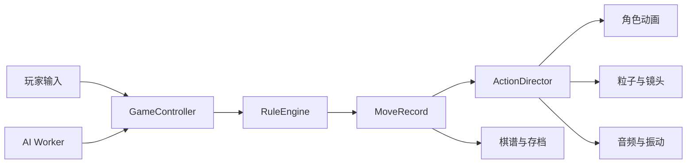

# 玄甲棋局二期开发方案

## 1. 文档信息

- 项目：玄甲棋局 3D 中国象棋
- 阶段：二期，单机公开试玩版
- 前置状态：一期本地双人原型已验收
- 目标周期：工程开发约 4 至 6 周，正式美术可并行 4 至 8 周
- 二期出口：具备正式美术、完整战斗演出、象棋 AI、棋谱存档和发布级性能的单机版本

## 2. 二期定位

### 2.1 核心目标

二期不是继续堆叠原型功能，而是将一期升级为可以公开展示和持续迭代的单机产品：

1. 用正式 GLB 角色替换程序化一期棋子，同时保持棋局辨识度。
2. 建立可复用的动作、击杀、音频和镜头时间线。
3. 接入不阻塞渲染线程的象棋 AI，支持三档难度和执红/执黑。
4. 加入棋谱、回放、保存、恢复和 FEN 导入导出。
5. 完成桌面与移动端性能优化、兼容测试和发布流程。

### 2.2 非目标

- 联网匹配、好友房、观战和断线重连。
- 账号、排行榜、商城、赛季和付费系统。
- 服务端权威裁决和反作弊。
- 长将、长捉等竞赛争议裁决，除非二期另行立项。
- 本地训练大型神经网络象棋模型。

以上能力继续放在三期或独立专项中。

### 2.3 成功指标

- 玩家能够完成“选择阵营、选择难度、对战 AI、悔棋、保存、恢复、结束”的完整流程。
- 32 枚正式棋子同屏时，桌面目标 50 至 60 FPS，主流手机不低于 30 FPS。
- AI 连续运行 100 局不产生非法着法、重复提交或主线程卡死。
- 所有移动、攻击、受击和移除严格按照表现事件点执行。
- 存档恢复后的局面、回合、棋谱、设置和棋子数量完全一致。

## 3. 开发前置门槛

### 3.1 许可证决策

一期规则依赖 `elephantops@0.1.1`，许可证为 GPL-3.0-or-later。常见象棋 AI 项目也可能采用 GPL。

M0 阶段必须确定发布方式：

- 路线 A：接受 GPL 要求，按照相应许可证发布。
- 路线 B：取得规则库和 AI 引擎的其他授权。
- 路线 C：替换为许可证兼容的规则与 AI 实现。
- 路线 D：自研或委托开发规则与 AI 核心。

在许可证路线冻结前，不应将当前依赖直接用于闭源商业发布。该事项需要专业法律意见时，应交由法务或许可证顾问确认。

### 3.2 一期技术基线

二期继续复用以下稳定边界：

- `src/game/rules`：规则适配层，负责合法着法、将军和胜负。
- `src/game/useGameController.ts`：棋局、选择、动画锁、历史和设置。
- `src/scene`：棋盘、棋子、特效、灯光和镜头。
- `src/ui`：回合状态、棋谱和工具栏。
- `MoveRecord`：规则层与表现层之间的唯一走子事件。

规则状态仍然是唯一事实来源。模型动画、特效、音频和 AI 都不能直接修改棋局状态。

## 4. 功能范围

### 4.1 正式 3D 棋子

- 红方采用朱红漆甲、铜金护片和轻捷轮廓。
- 黑方采用玄铁重甲、银灰护片和厚重轮廓。
- 使用“2 套阵营基础身体 + 7 套类型组件”的组合方式。
- 七类棋子通过体型、头冠、武器、肩甲和动作区分。
- 棋子底座继续保留传统汉字，保证中远距离识别。
- 支持 LOD、压缩纹理、模型预加载和加载失败回退。

### 4.2 动作与击杀演出

每类棋子至少支持：

- `idle`：待机呼吸或轻微甲片运动。
- `selected`：选中姿态。
- `move`：普通移动。
- `attack`：吃子攻击。
- `hit`：受击。
- `death`：碎甲、倒地或消散。
- `victory`：胜利姿态。

特殊表现建议：

| 棋子 | 移动表现 | 吃子表现 |
| --- | --- | --- |
| 车 | 重甲冲锋、地面尘轨 | 强力撞击、金属碎片 |
| 马 | 跃动弧线、马蹄残影 | 跃击、落地震环 |
| 炮 | 炮身蓄力、火星 | 爆燃、后坐力、烟尘 |
| 兵/卒 | 短促突进 | 近身劈砍 |
| 相/象 | 厚重踏步、阵纹 | 护阵冲击 |
| 仕/士 | 轻步、符纹 | 交叉武器斩击 |
| 帅/将 | 稳重移动、旗帜响应 | 统帅攻击和胜负演出 |

### 4.3 单机 AI

- 玩家可选择执红、执黑或随机阵营。
- 提供简单、普通、困难三档难度。
- AI 在 Web Worker 中执行，不占用 Three.js 主渲染线程。
- 支持取消思考、重开、悔棋和切换局面后的任务失效。
- AI 输出的走法必须再次通过项目规则层验证。
- AI 异常或超时不能破坏当前棋局，应显示可恢复状态。

推荐思考预算：

| 难度 | 单步时间 | 策略 |
| --- | ---: | --- |
| 简单 | 100 至 300 ms | 从候选着法中加入受控随机性 |
| 普通 | 500 至 1200 ms | 平衡搜索深度和响应速度 |
| 困难 | 2 至 4 s | 更深搜索，可提供取消按钮 |

### 4.4 棋谱、回放和存档

- 保存完整结构化着法，不只保存界面文本。
- 支持逐步前进、后退、跳转到首步和末步。
- 支持保存当前对局和恢复最近对局。
- 支持 FEN 导入导出，方便残局和测试局面分享。
- 存档必须包含 `schemaVersion`，为后续数据迁移保留能力。
- 棋谱回放期间不能修改正式对局状态。

### 4.5 音频和体验

- 增加移动、落地、甲片、武器、炮击、受击、将军和胜负音效。
- 背景音乐、环境音和战斗音效分别控制音量。
- 设置保存在浏览器本地。
- 增加棋盘翻转、先后手选择和减少动态效果模式。
- 手机端支持可关闭的振动反馈。

## 5. 技术架构



### 5.1 新增模块建议

```text
src/
├─ ai/
│  ├─ AiEngine.ts
│  ├─ ai.worker.ts
│  ├─ difficulty.ts
│  └─ protocol.ts
├─ assets/
│  ├─ manifest.ts
│  ├─ preload.ts
│  └─ fallbacks.ts
├─ game/
│  ├─ replay/
│  └─ persistence/
├─ scene/
│  ├─ animation/
│  │  ├─ ActionDirector.ts
│  │  └─ actionTimeline.ts
│  ├─ models/
│  └─ effects/
└─ audio/
   ├─ AudioDirector.ts
   └─ soundManifest.ts
```

### 5.2 `ActionDirector` 时间线

推荐事件顺序：

```text
MOVE_ACCEPTED
  -> ATTACKER_START
  -> CONTACT
  -> TARGET_HIT
  -> TARGET_REMOVE
  -> SETTLE
  -> TURN_READY
```

要求：

- `CONTACT` 前被吃棋子必须仍然存在。
- 粒子、音频和镜头震动从事件点触发，禁止分别使用无关联的延时器。
- 悔棋、重开或组件卸载时，时间线必须可以整体取消。
- 低特效模式可以缩短表现，但不能改变规则结果。

### 5.3 AI Worker 协议

```ts
type AiRequest = {
  requestId: number;
  fen: string;
  difficulty: "easy" | "normal" | "hard";
  timeLimitMs: number;
};

type AiResponse = {
  requestId: number;
  move: string | null;
  depth?: number;
  score?: number;
  error?: string;
};
```

`requestId` 用于废弃悔棋、重开或局面变化前发起的旧任务。

## 6. 美术资产规范

### 6.1 模型预算

| 项目 | 建议预算 |
| --- | --- |
| 单棋子 LOD0 | 12k 至 20k 三角面 |
| 单棋子 LOD1 | 4k 至 8k 三角面 |
| 单棋子 LOD2 | 1k 至 3k 三角面 |
| 单角色骨骼 | 不超过 60 根 |
| 单阵营共享贴图 | 1K 至 2K，KTX2 压缩 |
| 材质数量 | 每棋子尽量不超过 2 个 |
| 动画片段 | 通用动作共享，类型攻击独立 |

### 6.2 导出要求

- 格式统一为 `.glb`。
- 单位统一为米，原点位于棋子底座中心。
- 正面方向、骨骼命名和缩放规则统一。
- 使用 Meshopt 或 Draco 压缩模型。
- 使用 KTX2/Basis 压缩 PBR 纹理。
- 动画不得依赖 Blender 专有约束，导出前烘焙。
- 每个资产必须记录作者、来源和许可证。

### 6.3 资源清单

每个棋子类型至少交付：

- LOD0、LOD1、LOD2 模型。
- 基础色、法线、金属度/粗糙度贴图。
- 待机、移动、攻击、受击和阵亡动画。
- 红黑阵营材质变体。
- 无模型或加载失败时的一期程序化回退资产。

## 7. 性能与加载策略

### 7.1 性能预算

- 桌面完整棋局目标 50 至 60 FPS。
- 主流移动设备目标不低于 30 FPS。
- 设备像素比上限继续保持在可控范围。
- 桌面同屏 Draw Call 建议不超过 180，移动端不超过 120。
- GPU 资源占用建议控制在桌面 400 MB、移动端 220 MB 以内。
- 连续进行 50 次吃子演出后，粒子和对象数量不得持续增长。

### 7.2 加载策略

- 棋盘、UI 和低精棋子优先加载。
- 正式模型按照阵营和棋子类型分包。
- AI、回放和设置页面使用动态导入。
- 加载模型时显示真实棋盘和回退棋子，不使用空白营销页。
- 对模型、纹理和音频提供超时、重试和降级逻辑。

## 8. 硬件条件

### 8.1 程序开发电脑

| 配置 | 最低可用 | 推荐配置 |
| --- | --- | --- |
| CPU | 6 核 Intel i5 / Ryzen 5 | 8 核以上 Intel i7 / Ryzen 7 |
| 内存 | 16 GB | 32 GB |
| GPU | GTX 1660 / RX 580，4 GB 显存 | RTX 3060/4060 以上，8 至 12 GB 显存 |
| 硬盘 | SSD，剩余 40 GB | 1 TB NVMe，剩余 100 GB 以上 |
| 显示器 | 1080p | 2K 双显示器 |
| 系统 | Windows 10/11 或 macOS | Windows 11 或 Apple Silicon Mac |

均衡推荐配置为：`8 核 CPU + 32 GB 内存 + RTX 4060/4070 + 1 TB NVMe SSD`。

### 8.2 3D 美术工作站

- Ryzen 7/9 或 Intel i7/i9。
- 32 GB 内存起步，复杂高模和 4K 纹理建议 64 GB。
- RTX 4060 Ti 16 GB、RTX 4070 或更高。
- NVMe SSD，模型、贴图和缓存预留 200 GB。
- Blender、Substance Painter 等工具使用的显存是主要瓶颈。

如果只进行 React、规则和 AI 接入，不需要高端显卡。本地训练神经网络才需要 RTX 4080/4090 或云端 GPU，二期正常接入传统象棋引擎不需要。

### 8.3 测试设备矩阵

至少准备：

- 一台 RTX 3060/4060 级中档桌面电脑。
- 一台 Intel Iris Xe、AMD 680M 等集成显卡电脑。
- 一台骁龙 778G、骁龙 7 系或相近性能的 Android 手机。
- 一台较旧 Android 手机，用于验证低特效模式。
- 一台 iPhone 11/12 或更新设备，用于 Safari/WebGL 验收。
- 鼠标、触控板和真实触屏分别测试。

### 8.4 部署服务器

二期仍是静态 Web 单机应用，不需要 AI GPU 服务器：

- 静态托管、对象存储或 CDN 即可。
- 基础服务器使用 1 核 CPU、1 GB 内存即可托管构建产物。
- 不需要数据库和常驻 AI 服务。
- 在线服务、账号和对战服务器留到三期。

## 9. 测试策略

### 9.1 自动化测试

- 规则测试继续覆盖所有固定局面和非法着法。
- `ActionDirector` 使用虚拟时间测试全部事件点和取消行为。
- AI Worker 测试超时、取消、旧任务失效和非法返回值。
- 存档测试版本、损坏数据、恢复一致性和迁移。
- Playwright 覆盖阵营选择、AI 对局、悔棋、重开、保存、恢复和回放。
- 桌面与手机继续检查 WebGL 非空白像素和页面边界。

### 9.2 AI 稳定性测试

- 三档 AI 各进行至少 100 局自动对局。
- 每一步都通过规则层二次验证。
- 记录思考时间、搜索深度、异常和超时。
- 悔棋或重开后，旧 AI 结果不得提交到新局面。
- 页面切到后台再恢复时，不得产生重复走子。

### 9.3 视觉与性能测试

- 检查 14 个阵营/类型组合的模型、贴图和动画。
- 远、中、近三个相机距离验证棋子识别度。
- 在三档特效、三档 AI 和两个相机模式下采集帧率。
- 连续重开、悔棋和吃子，检查内存与对象数量。
- 使用真实 Android 和 iPhone 测试触控、发热和页面高度变化。

## 10. 里程碑与排期

| 里程碑 | 预计时间 | 主要工作 | 完成出口 |
| --- | ---: | --- | --- |
| M0 规格与许可证冻结 | 2 至 3 天 | 发布方式、AI 选择、资产规范、性能预算 | 依赖和发布路线明确 |
| M1 GLB 资产流水线 | 6 至 8 天 | 加载器、骨骼、LOD、贴图压缩、回退模型 | 两阵营七类型可完整加载 |
| M2 动作与战斗演出 | 4 至 6 天 | ActionDirector、动画、粒子、音频、震动 | 吃子时间线完整可取消 |
| M3 AI 接入 | 4 至 6 天 | Worker、协议、三档难度、先后手 | AI 对局可完成且无非法着法 |
| M4 棋谱与存档 | 3 至 4 天 | 保存、恢复、回放、FEN | 刷新后可恢复同一局面 |
| M5 优化与发布验收 | 4 至 5 天 | 分包、LOD、兼容测试、发布包 | 二期验收标准全部通过 |

工程总周期约 23 至 32 个有效开发日。美术资源可从 M0 后并行制作。

## 11. 团队配置建议

最低配置：

- 1 名前端/Three.js 工程师。
- 1 名 3D 角色与技术美术。
- 1 名兼职音效/VFX 人员。
- 1 名熟悉中国象棋的测试或产品验收人员。

单人开发也可以完成工程部分，但定制高精模型、动画和音频会显著拉长周期。若使用外包资产，必须在 M0 冻结骨骼、尺寸、材质、命名和导出规范。

## 12. 二期验收标准

### 12.1 产品流程

- 可选择玩家阵营和 AI 难度。
- AI 可正常执红或执黑。
- 可完成一整局单机对战。
- 悔棋、重开、保存、恢复和回放状态一致。
- 将军、绝杀、困毙和胜负演出正确。

### 12.2 3D 与演出

- 红黑阵营和七类棋子在不看汉字时仍有明显差异。
- 目标棋子只在命中或死亡事件后移除。
- 动画、粒子、声音和镜头事件保持同步。
- 降低或关闭特效后仍能清楚理解走子和吃子结果。
- 模型加载失败时自动使用一期程序化棋子。

### 12.3 AI 与可靠性

- 自动对局至少 100 局无非法着法。
- AI 思考期间界面和 3D 场景保持可交互。
- 取消、悔棋和重开后不接受过期 AI 结果。
- AI 加载失败时允许切回本地双人，不产生空白页面。

### 12.4 性能

- 中档桌面目标稳定 50 FPS 以上。
- 主流手机目标稳定 30 FPS 以上。
- 首次可操作目标不超过 4 秒，正式资源允许后台渐进加载。
- 控制台无持续错误，构建、lint、单测和 E2E 全部通过。

## 13. 主要风险

| 风险 | 影响 | 应对 |
| --- | --- | --- |
| GPL 许可证与发布模式冲突 | 无法按预期闭源商业发布 | M0 完成许可证决策，规则与 AI 继续保持可替换接口 |
| 正式模型过重 | 手机掉帧、加载慢 | LOD、KTX2、Meshopt、材质合并和资源预算门禁 |
| 动画与规则状态竞争 | 目标提前消失、重复走子 | 使用 ActionDirector 和可取消事件时间线 |
| AI 阻塞主线程 | 场景卡顿、移动端无响应 | Web Worker、时间预算和任务取消 |
| 存档升级不兼容 | 用户局面丢失 | schemaVersion、迁移测试和损坏数据回退 |
| 棋子造型难辨认 | 误操作、依赖试点 | 类型轮廓评审、汉字底座和中远距离测试 |
| 美术外包规范不一致 | 大量返工 | 首个样板角色通过后再批量制作 |

## 14. 二期交付物

- 正式二期源码和生产构建。
- 两阵营七类型 GLB 资产及 LOD。
- 动画、VFX、音频和资源清单。
- AI Worker、难度配置和稳定性测试报告。
- 棋谱、回放、存档和 FEN 功能。
- 桌面与移动端性能报告。
- 自动化测试、验收截图和已知限制。
- 第三方依赖与美术/音频许可证清单。

## 15. 启动清单

1. 决定开源、闭源或商业发布路线。
2. 完成规则库和 AI 引擎许可证评估。
3. 冻结 GLB、骨骼、材质、LOD 和命名规范。
4. 先制作一枚红车和一枚黑车作为完整资产样板。
5. 建立 ActionDirector，并打通一次完整吃子时间线。
6. 建立 AI Worker 空实现和可取消消息协议。
7. 冻结存档 schemaVersion 与 FEN 接口。
8. 样板通过性能和视觉验收后，再批量生产其余资产。

二期必须先解决许可证、资产规范和表现时间线，再并行推进正式美术与 AI。任何联网、账号或商业化功能默认不进入二期关键路径。
