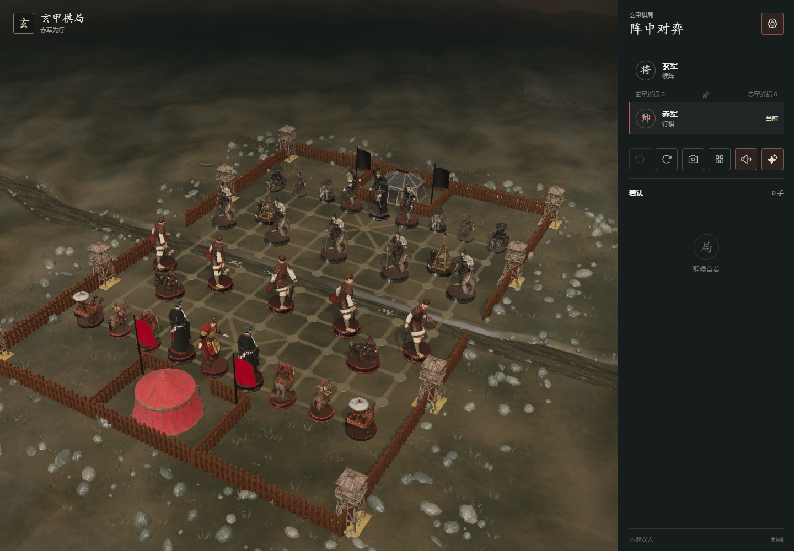

> 历史静态制作记录。木质棋盘主体随后被 C1 战场地形替换；当前状态、费用与验收见 [最新交付报告](PRODUCTION_DELIVERY.md)。本页图片路径可能展示后续版本。

# 静态美术与游戏接入交付

2026-09-06，依据用户认可红帅样板后授权的 [API 制作计划](../API_ASSET_PRODUCTION_PLAN.md)。14 枚棋子、4 类棋盘模型、6 套 PBR 和 14 类图像已制作并接入。桌面及窄屏浏览器检查通过；**手机真机性能、天空与远景原生 ≥2K 仍未达到原计划验收条件**，没有将它们标为通过。

## 查看成品

在项目根目录运行 `npm run dev -- --port 4175`：

- [进入棋局](http://127.0.0.1:4175/)：32 枚新棋子、战场棋盘、场景材质、烟雾和余烬。
- [14 枚棋子检视](http://127.0.0.1:4175/asset-gallery.html)：选择棋子、旋转、缩放、比较 4K/2K/1K 三档，下载当前 GLB。
- [红帅完整源高模](http://127.0.0.1:4175/master-review.html)：用户指定官网原件的完整几何与新贴图。
- [天空立方体检查](http://127.0.0.1:4175/sky-review.html)：开发用六方向与对角投影检查页。



## 交付数量与规格

| 类别 | 数量 | 源资产 | 运行文件 |
| --- | ---: | --- | --- |
| 棋子 | 14，供 32 枚实例复用 | 完整高模；每枚 Base Color 8192²，法线和 ORM 4096²；14 个打包纹理的 Blender 源工程 | 三档 4K/2K/1K，各有 KTX2 与 WebP 备用 GLB，共 84 个 |
| 棋盘与建筑 | 主体、红营、黑营、瞭望塔，共 4 类 | Base Color 8192²，辅助贴图 4096²；4 个 Blender 源工程 | 两档 4K/2K，各有 KTX2 与 WebP，共 16 个 |
| 表面材质 | 泥土、石材、旧木、金属、红布、黑布，共 6 套 | Base Color、法线 4096²；粗糙度、金属度 2048²，原件与接缝修订版分别保存 | 两档 4K/2K 的载体 GLB，各有 KTX2 与 WebP，共 24 个；游戏使用 2K 表面包 |
| 图像 | 建模参考 4、天空 6、远景 2、氛围 2 | 14 个用途，另留 4 个失败初稿；原始 PNG 全部归档 | 天空 1024²；山线、营地 1376×768；余烬、薄烟 1024²，后四张保留 alpha |

合计 **124 个运行 GLB**。KTX2 包合计 867.20 MiB，连同 WebP 备用共 1176.26 MiB；这是全部平台、精度、备用文件的仓库总量，游戏按需求加载。8K 高模原件不进入主游戏加载路径。完整来源、每张实际尺寸、文件体积、SHA-256 与源工程位置见 [production.json](production.json)；运行路径清单见 [production-manifest.json](../../public/assets/production-manifest.json)；18 个源工程与 6 套表面的索引见 [source/production.json](../../assets/source/production.json)。

纹理采用 UASTC KTX2、Zstd 18 和完整 mipmap，法线保留标准 glTF XYZ 通道。KTX2 通常比 WebP 的磁盘体积大，其用途是降低 GPU 纹理解码与驻留成本。没有把缩小或插值放大的图称为原生高分辨率。

## 棋子逐项结果

| 资产 | 保留的源高模三角面 | 结构复核 |
| --- | ---: | --- |
| `general_red` 帅 | 3,010,366 | 用户指定原件；完整披风、冠冕和底座 |
| `general_black` 将 | 3,897,429 | 高将身形、披风、闭合底座饰带；组装修订版保留 |
| `advisor_red` 仕 | 3,049,406 | 采用第三版候选，保留人物、器物与完整底座 |
| `advisor_black` 士 | 3,079,922 | 采用第二版候选，人物站立与底座接触 |
| `elephant_red` 相 | 3,736,036 | 象、骑乘平台、华盖及补全底座 |
| `elephant_black` 象 | 2,938,730 | 四足、象牙、乘员及木构平台 |
| `horse_red` 马 | 3,063,046 | 四足与底座接触、骑手、马具和旗帜 |
| `horse_black` 马 | 3,029,762 | 四足、骑手和附属器物 |
| `chariot_red` 车 | 3,053,606 | 双马、车轮、车架、人物和华盖 |
| `chariot_black` 车 | 3,044,526 | 双马、双轮、车架与人物 |
| `cannon_red` 炮 | 3,059,374 | 炮身、车架、炮手与底座 |
| `cannon_black` 炮 | 3,059,610 | 抛石机构、投臂、绳索、乘员与石弹 |
| `soldier_red` 兵 | 3,078,558 | 武器、衣甲和完整底座 |
| `soldier_black` 卒 | 3,077,168 | 武器、衣甲和完整底座 |

全部 14 枚的纹理迁移都经过独立 float32 世界坐标三角面逐位相同校验；UV 接缝拆点不会算作几何丢失。该校验与原件哈希在最终审计中再次核对。组装修订的黑将、红相以其已修复源高模为比较对象。多视角记录在每枚源高模旁的 `renders/`；[42 张运行档位截图与浏览器结果](pieces/browser.json)覆盖全部棋子三档。

运行几何使用约 **60k / 20k / 12k** 三角面。较初始 20k/8k/3k 目标保留更多网格，用于维持底座、细杆、车轮和复杂轮廓；高模保持独立原件，桌面整盘绘制预算已实测，移动真机的预算仍待确认。棋盘主体约 80k/30k，三类建筑约 30k/12k。确切面数以逐文件清单为准。

## 场景与交互复核

- 棋盘规范化为 10.25×11.35，落子区高度 0.25；中央河槽收至两排之间，并重新烘焙主体纹理，消除直接简化产生的纹理扇形拉伸。
- 最终 KTX2 主体的桌面、移动两档各做 90 次向下射线，覆盖全部交点且高度误差小于 0.008。[最终落点报告](environment/board-final-rays.json)
- 格线、九宫、楚河汉界及棋名使用代码和字体生成。棋名使用共享图集与单次实例绘制；点击面与显示网格独立。
- 桌面和窄屏的顶视都包含全部 90 个落点，棋盘横排偏斜小于 3 像素；窄屏设置入口、质量切换、旋转、缩放、选中、连续落子、吃子、悔棋通过。[交互及性能记录](game/performance.json)、[画质和镜头记录](game/camera-quality.json)
- 泥地去除初稿局部亮斑；6 套表面按周期边界校正，原件保留。完成 3×3 平铺及 [俯视](environment/surfaces-overhead.png)、[掠射光](environment/surfaces-grazing.png)检查。
- 天空统一地平线与曝光，再按世界方向混合相邻面。12 条边的最差 RGB 平均差约 1.19/255；六个真实立方体视角未见明显断缝。[边缘数值](environment/sky-seams.json)、[对角投影](environment/sky-view-0.png)
- 两层远景与两张氛围图的第一版有棋盘格底色，已拒绝；第二版重新生成后处理 alpha 与边缘。远景底边对齐地面，烟雾和余烬仅完整特效启用。
- 地面远端按世界距离渐隐到天空，低角度旋转时不会露出有限地面网格的硬边。[低角度场景](game/desktop-orbit.png)
- 单模型 404 时其余模型与棋盘继续显示，失败棋子保留可操作备用造型；恢复请求后可手动重试。屏蔽 Basis 解码器时 24 个活动模型/材质切到 WebP，未留下缺图白模。[失败与重试记录](game/fallback.json)
- 相同 URL 的模型、几何和贴图共享；同时最多 3 个模型加载，KTX2 最多 2 个工作线程。无使用者资源延迟 15 秒释放，档位切换含滞回。浏览器画质检查未出现重复实例导致的重复模型请求。

## 性能与适用范围

测试设备：Windows、NVIDIA GeForce RTX 4060、Chrome headless、ANGLE D3D11；通过 `?audit=1` 统计同帧主渲染和阴影，保留最近 240 帧。每项完成加载后运行再采样，采用默认自动画质。桌面页面 1440×1000；移动项为同一电脑的 Pixel 7 视口与触控模拟，**不能代表手机 GPU**。

| 环境 | 特效 | P95 帧间隔 | 整帧绘制 | 估计纹理驻留 |
| --- | --- | ---: | ---: | ---: |
| RTX 4060 桌面 | 完整 | 5.6 ms | 103 | 474.4 MiB |
| 同上 | 简洁 / 关闭 | 5.7 ms | 100 / 100 | 474.4 MiB |
| 同机窄屏模拟 | 完整 | 5.7 ms | 95 | 266.4 MiB |
| 同上 | 简洁 / 关闭 | 5.7 ms | 92 / 92 | 266.4 MiB |

估计驻留按独立纹理源和 mip 字节累计，包含尚在保留期的缓存；不是显卡驱动报告的实际 VRAM。P95 是帧间隔而非单独 GPU 执行时间。此次桌面结果满足 P95 ≤20ms、绘制 ≤180；移动绘制低于 120，但 P95 ≤33.3ms 的真机条件待测。没有将本机结果外推至全部设备。

## 费用、修订与归档

| 类别 | 实耗积分 |
| --- | ---: |
| 棋子建模与旧样板 | 510 |
| 14 枚棋子的 8K 贴图 | 210 |
| 4 类棋盘模型 | 140 |
| 6 套表面材质 | 60 |
| 14 张首轮图像与 4 张修订 | 162 |
| **累计** | **1082** |

62 笔任务全部成功且已下载归档，没有未完成预留。实际账户余额于 2026-09-06 核对为 **1983**；低于 1800 客户端累计支出上限，且余额高于 1200 下限。相对 921 基线增加 161：五次棋子几何候选修订 125，加四张图像修订 36。Remesh 和本地导出未额外调用付费接口。[去除密钥与签名下载地址的逐任务账本](ledger.json)保留任务 ID、参数、输入哈希、文件哈希与费用。

原始下载与失败候选留在 `assets/generated/meshy/`，正式运行文件放在新路径 `public/assets/{models,board}/production/` 和 `public/assets/environment/`，旧原型模型保留。303 个 API 下载文件全部复核存在且字节数与账本一致，原始下载合计 6,074,799,410 字节。源工程及母版与运行档分开；源资产已在本地保存，不依赖 API 临时保留期。账本和检查 JSON 另备份于 `.meshy/backups/`。当前是同一工作盘内的归档，未宣称另有异地副本。

## 可复核命令与未通过项

```powershell
npm test
npm run lint
npm run build
npm run test:meshy
$env:CN_CHESS_BROWSER_CHANNEL = 'chrome'
npm run test:e2e
node scripts/check_production_game.mjs
node scripts/check_camera_quality.mjs
node scripts/check_asset_fallbacks.mjs
node scripts/check_environment.mjs
python scripts/audit_production_assets.py
```

验收脚本需要本地开发服务运行于 4175。棋子重新导出用 `blender/export_piece_runtime.py`、`blender/bake_piece_distant.py`；场景用 `blender/export_scene_runtime.py`，棋盘主体另以最终源工程重新烘焙；KTX2 用 `scripts/compress_glb_textures.py`。全部输入、版本和实际输出由 `production.json` 关联，避免把废弃候选误用为母版。

- [x] 19 项前端单元测试；54 项 API 离线用例；lint；生产构建。
- [x] Playwright 端到端测试 5 项通过、1 项按配置跳过（仅移动端运行的走子用例不在桌面重复运行）。Node 24.16.0、Python 3.13.7。
- [x] 浏览器交互、42 个棋子档位加载、模型/解码器失败回退、180 次落点射线和画质检查。
- [ ] 手机真机性能、发热及长时间内存稳定性。
- [ ] 天空单面与远景原生 ≥2K。当前 API 实返天空 1K、远景 1376×768；现有远距画面检查通过，分辨率目标仍保留为待补项。

本轮模型为完整静态网格。角色骨架、可动机械部件拆分、七段角色动画、存档、回放、AI 和联网继续按二期/三期计划处理；这份报告只覆盖本轮静态美术及接入。
